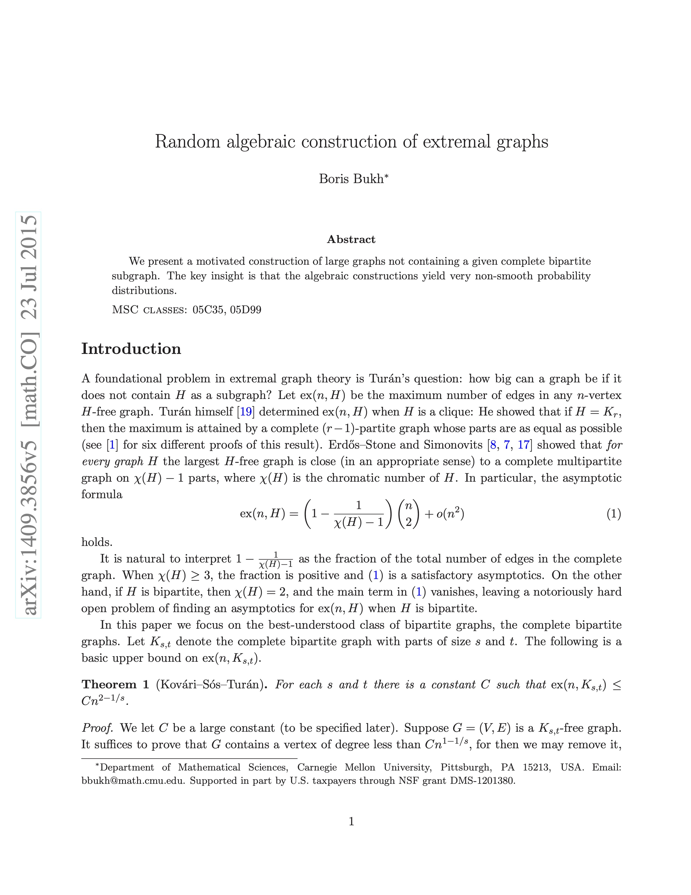
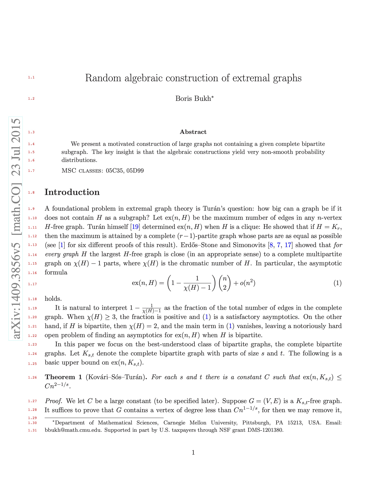

# Overview

Findliner is an open-source software tool designed to add line numbers to the margins of PDF files. This utility is particularly useful for academic and scientific communities, facilitating precise references during the peer review process of scholarly papers.

Below is a side-by-side comparison to illustrate the impact of adding line numbers to a PDF document using Findliner. The "Before" image shows a sample PDF page without line numbers, which can make referencing specific lines during the review process challenging. The "After" image displays the same page after applying Findliner, specifically using the command
```bash
findliner 1409.3856v5.pdf --hex_color=#FF3131 --margin_left=40
```
This command adds line numbers to the margin with a custom color and adjusted margin setting, enhancing clarity and ease of discussion.

| Before | After |
|:----------------:|:---------------:|
|  |  |

# Features
- **Line Numbering**: Adds line numbers to the PDF margins, enhancing reference accuracy in document reviews.
- **Customizable Margins**: Allows users to specify the margin on the left of the line numbers.
- **Color Customization**: Users can specify the hex color code of the line numbers to blend with the document's theme or to stand out.
- **Font Customization**: Provides options to adjust the font size and the baseline shift of the line numbers, ensuring compatibility with various document formats.
- **Selective Numbering**: Options to ignore the first few lines and the last few lines on each page, accommodating documents with headers and footers.
- **Verbose Mode**: Enhances troubleshooting and detailed output generation during the numbering process.

# Installation
## Prerequisites
Before installing Findliner, ensure that you have `pip` (the package installer for Python), `Ghostscript` and `ImageMagick` installed on your system. These can be installed as follows:

### For Debian/Ubuntu
```bash
sudo apt update
sudo apt install python3-pip ghostscript imagemagick
```
### For Fedora
```bash
sudo dnf install python3-pip ghostscript ImageMagick
```
### For MacOS
Using Homebrew:
```bash
brew install python ghostscript imagemagick
```

## Relax ImageMagick Security Policy
On Debian/Ubuntu and Fedora, the default ImageMagick security policy might block PDF conversion. The restricted policy is made to prevent unknown vulnerabilities coming from third party software (such as Ghostscript used for PDF files). To allow PDF file handling, edit the ImageMagick policy file:

1. Identify your ImageMagick version using:
```bash
convert --version
```
2. Modify the policy file:
```bash
sudo sed -i 's/<policy domain="coder" rights="none" pattern="PDF" \/>/<policy domain="coder" rights="read | write" pattern="PDF" \/>/' /etc/ImageMagick-<X>/policy.xml
```
Replace `<X>` with your ImageMagick version number (either 6 or 7) as found earlier.

## Installing Findliner
Clone the Findliner repository and install using pip:
```bash
git clone https://github.com/libragold/findliner.git
cd findliner
pip install --editable .
```

## Updating Findliner
To update Findliner to the latest version, navigate to the Findliner directory, pull the latest changes, and reinstall in editable mode:
```bash
cd findliner
git pull
pip install --editable .
```
This will ensure you have the latest code and the updated package.

# Usage
To add line numbers to a PDF file:
```bash
findliner FILENAME [OPTIONS]
```
## Options:
- `--offset_top INTEGER`: Ignore the first few lines of content on each page.
- `--offset_bottom INTEGER`: Ignore the last few lines of content on each page.
- `--margin_left INTEGER`: Specify the margin on the left of the line numbers (default: 35).
- `--hex_color TEXT`: Specify the hex color code of the line numbers (default: #000000).
- `--font_size INTEGER`: Specify the font size of the line numbers (default: 6).
- `--baseline_shift INTEGER`: Reposition the baseline of the line numbers (default: -2).
- `--verbose`: Enables verbose mode for detailed output.

For further assistance, use:
```bash
findliner --help
```

# Known Issues and Fixes
## ImageMagick Version Issue on Debian/Ubuntu
The default ImageMagick version (6.9.X) installed via `apt` on Debian/Ubuntu may occasionally cause overlapping line numbers on PDFs with colored backgrounds, although this issue is not common. Upgrading to ImageMagick 7.1.X resolves this issue. If you encounter this problem, we recommend upgrading using the "ImageMagick Easy Install" script available on [GitHub](https://github.com/SoftCreatR/imei), which simplifies the installation of the latest version of ImageMagick.

# Contributing
Contributions are welcome! Please fork the repository and submit pull requests with your suggested changes. For major changes, please open an issue first to discuss what you would like to change.
